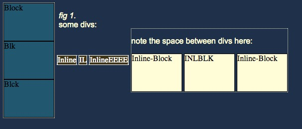

 

As someone new to web design it is easy to get hung up on its most recognizably strange aspects: Memorizing code and syntax, being conscious of things like indentations and commenting and the like. Having mastered the entire process of typing an anchor tag (to make a link- I guess it isn't called an "a" tag) I coasted into the second half of this week ready to slap my first website together from scratch. And then... things come grinding to a halt. I doubt I'm the first. It had nothing to do with syntax. This was about positioning.

I was struggling to make my header and navigation elements nest together comfortably at most reasonable screen resolutions. I had already mapped it out in my head, had a pretty good idea of how I'd do it (lots of divs), so it was mostly going to be a challenge of typing all the div tags out without making a mistake. Checking in on my work the first time in a browser, it was a complete mess. Things piled up on top of each other, not respecting the dimensions I'd set, I didn't even know where to start finding answers.

The fact is that there are a LOT of different elements and attributes and properties. When <em>I</em> think about positioning (so far) I have been focused on static vs. relative vs. absolute vs. fixed - maybe something about floats at times. I've tended to overlook the importance of the <strong>display</strong> property. However, understanding some of its quirks can go a long way towards other confusing positioning problems.

<em>Block</em> elements are probably the easiest to recognize for someone who is brand new to writing html. They are the most visible because we can tell them how much space to take up: an block element can have its width and height set, which is probably the reason I think of the div as a box. Importantly, block elements also automatically create a new line- this is why we use the <em>float</em> property to place divs horizontally next to each other when we don't want them to stack.

<em>Inline</em> elements are just the opposite. Their  dimensions are limited to what they contain and they can't be set otherwise; they don't create a new line, but rather sit together in a line.

Inline display gives us a much greater control and new ways to arrange elements on a page, but what if we still want to control our element like a block- to set it height, for example? By entering the property display:inline-block we can do just that. <em>Inline-block</em> elements flow from left to right across the page, making them easy to stack for a horizontal nav, a grid of photos, etc. They can be manipulated with properties like height, width and vertical-align.

<a href="http://designshack.net/articles/css/whats-the-deal-with-display-inline-block/">Design Shack</a> goes much deeper into this topic, especially comparing the advantages and quirks of the inline-block display property to those of floats. Each has its own alignment solutions, its own workarounds. Inline-block elements tend to create a tiny whitespace next to each other, floats tend to collapse their container boxes and need an overflow:auto property set to prevent it. And there is more.

As a new developer, these nuances are something that I know I will only pick up through practice and repetition and asking for help again and again. At the same time, I've worked through and implemented solutions that use <em>display</em> in contradictory ways on different parts of my site. Like <em>position</em> this is a distinction worth knowing and taking the time to learn intentionally- rather than through osmosis.

